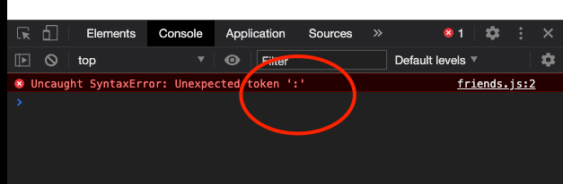

## Test CORS and JSONP
### 1. Install **node-dev**
>Run ```yarn global add node-dev```

### 2. Run **qq.com**
> #### Under the folder **qq.com**
> Run ```node-dev server.js 8888```


### 3. Run **frank.com**
> #### Under the folder **frank.com**
> Run ```node-dev server.js 9999```

### 4. Modify Hosts file (For  MAC)
> (1) Launch **Terminal**, type ```sudo nano/private/etc/hosts``` and press **Return**, then enter your admin password to execute it.
>
> (2) You are now in the ```Nano Editor```. Use the arrow keys on your keyboard and navigate to the bottom of the file, add two lines.
> > ```127.0.0.1    qq.com```
>
> > ```127.0.0.1    frank.com```
>
> (3) Press ```Control-O``` to save the file.


### 5. Modify Hosts file (For  Windows)
> (1) Click ```Start``` type ```notepad```, right click it and select ```Run as Administrator```
>
> (2) Click ```File``` tab then select ```Open```, go to your system root folder, most commonly ```C:\Windows``` and navigate to ```System32\drivers\etc```, on the right conner select ```All files(**)```, select  ```hosts``` file
>
> (3) Go to the bottom of the file and add the desired IP followed by the host name (or domain name). Save the file and you are all set.

#### Once you have change the hosts file and  run ```node-dev server.js``` for each folder(frank.com and qq.com), you can replace the URL in the Browser correspondingly.
> ```qq.com:8888/index.html```  replace ```localhost:8888/index.html```
>
> ```frank.com:9999/index.html``` replace ```localhost:9999/index.html```
>

## 记录一次错误
> 1. 源代码连接: https://github.com/Yueran-Yu/JRG-Course/tree/master/Cross-Origin-Resource-Sharing
> 2. 运行步骤写在 README.md 里面了
> 3. 问题： 我按照你视频里的代码敲了 window.xxx({{data}})，但是  visual code 一直 有报错提示，
>
>> 在 qq.com>public>friends.js 文件里 写window.xxx = {{data}}
>>
>>在 frank.com>public>frank.js 里写 script.onload = () =>{console.log(window.xxx);}
>>
>> 这两句一起在的时候，console 有结果，vs code 运行也有结果，但是 还是有错误提示的波浪线在  {{data}}  这里，
>>

>> 在 qq.com>public>friends.js 文件里 写成方法  window.xxx({{data}})
>>
>> 在 frank.com>public>frank.js 里写 window.xxx = (data) => {console.log(data)}
>>
>> 这两句一起在的时候，console 显示有错误 Uncaught SyntaxError: Unexpected token ':'， {{data}}  这里一直错
> 4. 期待结果： {{data}}  应该能通过运行的啊

###  单行注释  多行注释  对 运行 json 文件的影响
> 
> 
> 

### 这条错误记录显示 没有点进去查看
> 
>


